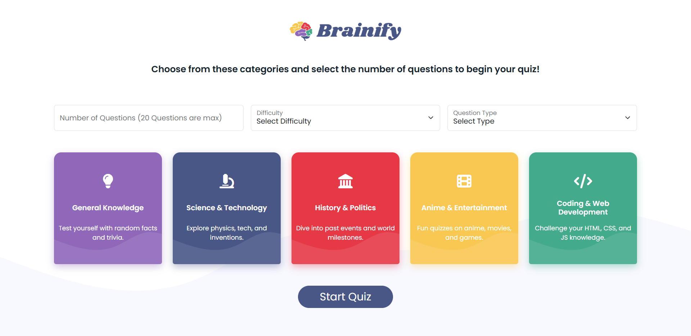
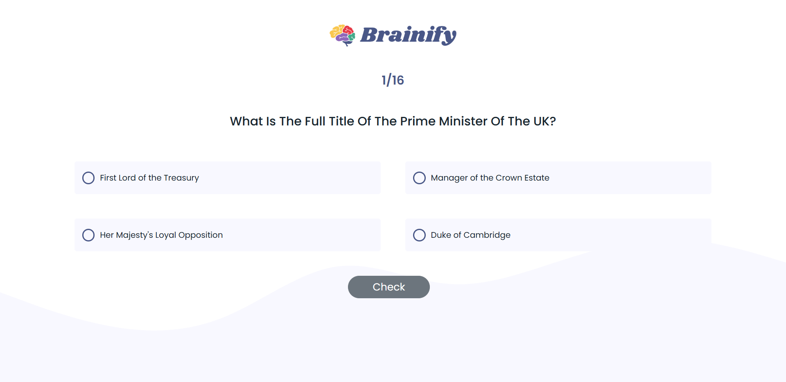
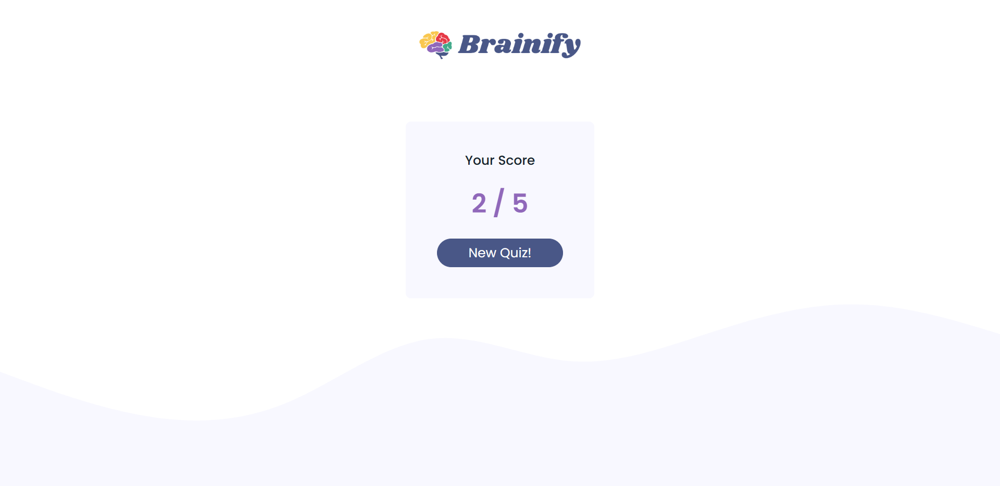

# 🧠 Brainify – Interactive Quiz App

Brainify is a responsive and dynamic quiz web application that allows users to select from multiple categories, difficulty levels, and question types. It fetches real-time trivia questions from the [Open Trivia Database API](https://opentdb.com/) and gives instant feedback on correct or incorrect answers.

 <!-- Optional: Replace with a real image path or remove -->

---

## 🚀 Live Demo

👉 [View Live on GitHub Pages](https://momen5406.github.io/Brainify-Quiz-App/)
*(Replace with your actual link)*

---

## ✨ Features

* 🎯 Choose quiz category, difficulty, and type
* 🧩 Real-time question fetching using Open Trivia API
* ✅ Instant feedback on selected answers
* 📊 Track your score and quiz progress
* 💻 Fully responsive UI using Bootstrap 5
* 🎨 Clean, modern design with custom styles

---

## 📸 Screenshots

<!-- Replace with actual paths to screenshots or remove if not available -->

| Home                        | Question                        | Result                        |
| --------------------------- | ------------------------------- | ----------------------------- |
|  |  |  |

---

## 🛠 Tech Stack

* **HTML5**
* **CSS3** (Bootstrap 5)
* **JavaScript (ES6+)**
* **[Open Trivia API](https://opentdb.com/)**

---

## 📂 Project Structure

```text
brainify/
├── index.html
├── css/
│   └── index.css
├── js/
│   └── index.js
├── img/
│   └── icon.png
│   └── wave.svg
└── README.md
```

---

## 🏷️ Topics

```
quiz-app, javascript, vanilla-javascript, html, css, bootstrap,
responsive-design, web-development, frontend-project, open-trivia-api, trivia-game
```

---

## 🙋‍♂️ Author

Made by **Mo’men Hussein**
📬 [LinkedIn](https://www.linkedin.com/in/momen5406) | [GitHub](https://github.com/momen5406)

---

## 🤝 Contributions

Feel free to fork this repo, open issues, or submit pull requests!
This project is beginner-friendly and great for practicing JavaScript, API integration, and responsive UI.
